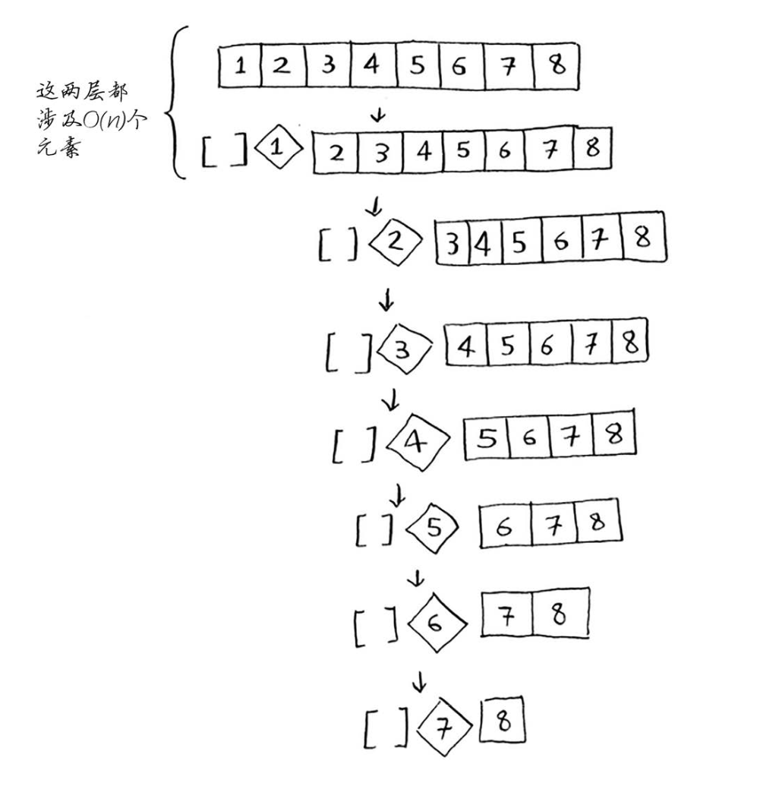
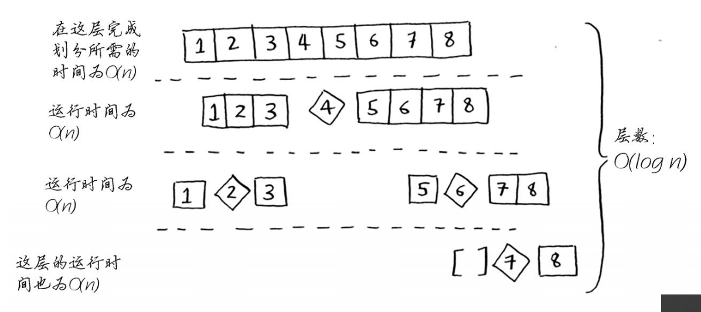

# 快速排序的时间复杂度分析

先说结论：最差情况下 $O(n^2)$、最佳情况下 $O(nlogn)$。

## 最差情况

我们对一个有序数组进行**快速排序**，并选择第一个元素（最小值）为**基准值**。

分析上图：

- 每一层涉及 $n$ 个元素。
- 因为我们的基准值是最小值，导致每一层左数组都为空，使得调用栈非常长，高度为 $n$。

故：最差情况的运行时间为：$n * n = n^2$。

## 最佳情况

同上，这次我们选择中间的元素（中位数）为**基准值**。

分析上图：

- 每一层涉及 $n$ 个元素。
- 每次都对半分为两个数组，调用栈高度为 $O(logn)$。

故：最佳情况的运行时间为：$O(n) * O(logn) = O(nlogn)$。

> 最佳情况也是平均情况，只要我们每次都随机选择一个数作为基准值，平均运行时间就是 $O(logn)$。