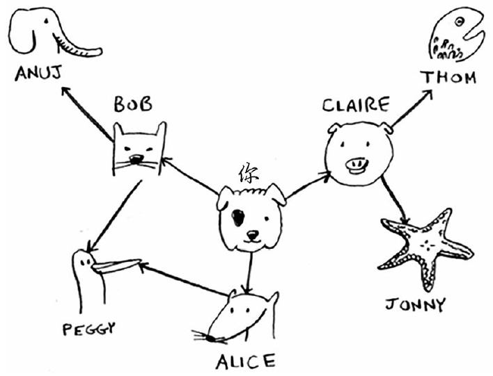
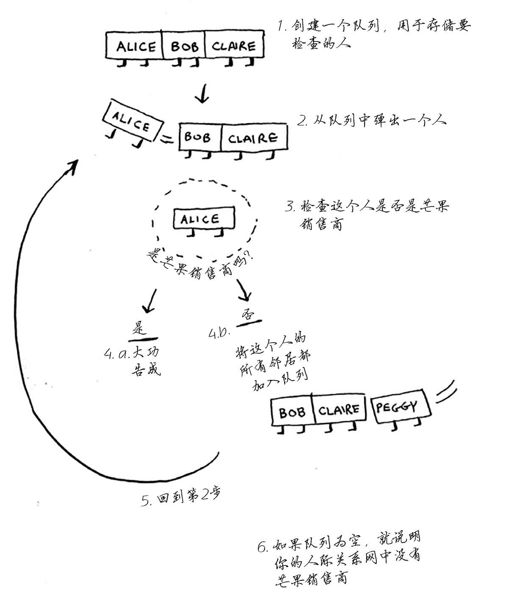

# 需求：通过人脉网，找到最近关系的芒果经销商

> 意思就是先从一级人脉里找（也就是你的朋友），再二级人脉（朋友的朋友），再三级….

## 假设你的人脉关系图如下




> 该例我们假设 thom 在做芒果生意

## JS中将其抽象为“图”数据结构

```js
const graph = {}
// 一级
graph["you"] = ["alice", "bob", "claire"]
// 二级
graph["alice"] = ["peggy"]
graph["bob"] = ["anuj", "peggy"]
graph["claire"] = ["thom", "jonny"]
// 三级 本例为空
graph["anuj"] = []
graph["peggy"] = []
graph["thom"] = []
graph["jonny"] = []
```

## 算法原理图



> 注意：小心循环引用，要创建一个数组存储已经检查过的人。

## 代码实现见当前目录下 js 文件