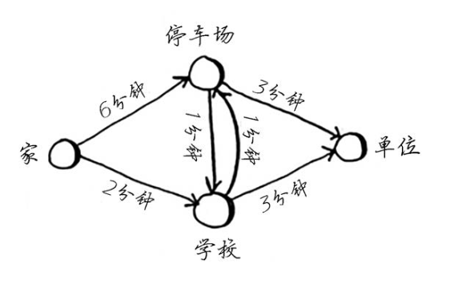

# 迪杰斯特拉(Dijkstra)算法

Dijkstra 算法从指定的节点（源节点）出发，寻找它与图中所有其它节点之间的最短路径（或者描述为：找出最“便宜”的节点）。

> Dijkstra 算法要求图中不存在“负权重边”。“负权重边”的情况，可以使用 Bellman-Ford 算法。

## 计算步骤

对于下图，计算“家”到“单位”的最短路径：

我们以广度优先搜索，一层层的向外检查。

### 初始状态

| 节点名称 |   开销   | 父节点 |
| :------: | :------: | :----: |
|    家    |    0     |  null  |
|  停车场  | infinity |  null  |
|   学校   | infinity |  null  |
|   单位   | infinity |  null  |

### 第一轮

“家”的邻居节点只有两个“学校”和“停车场”，到“学校”是 2 分钟，到“停车场”是 6 分钟。

那么我们就可以确定，从“家”到“学校”的最短路径是 2 分钟。因为你从“家”到“停车场”已经花了 6 分钟了，再从“停车场”到“学校”不可能走出负数吧。

> 这也是为什么 Dijkstra 算法，不适用于有“负权重边”的原因。

检查完毕，更新“学校”和“停车场”的开销和父节点，标记“家”为已检查。

|   节点名称   |     开销      |   父节点   |
| :----------: | :-----------: | :--------: |
| 家（已检查） |       0       |    null    |
|    停车场    | infinity => 6 | null => 家 |
|     学校     | infinity => 2 | null => 家 |
|     单位     |   infinity    |    null    |

> 注：这一轮仅能确定“家”到“学校”这条最短路径。

### 第二轮

当前开销最小的节点是“学校”，对其进行下一轮检查。

“学校”的邻居节点有“停车场”和“单位”：

- “停车场”：2 + 1 = 3，小于原本的开销 6，故更新“开销”和“父节点”。
- “单位”：2 + 3 = 5，小于原本的开销 infinity，故更新“开销”和“父节点”。
- 标记“学校”为已检查。

|    节点名称    |     开销      |    父节点    |
| :------------: | :-----------: | :----------: |
|  家（已检查）  |       0       |     null     |
|     停车场     |    6 => 3     |  家 => 学校  |
| 学校（已检查） |       2       |      家      |
|      单位      | infinity => 5 | null => 学校 |

> 注：这一轮已经确定“家”到“停车场”的最短路径了，因为“停车场”的开销是所有未检查节点中最低的。

### 第三轮

当前开销最小的节点是“停车场”，对其进行下一轮检查。

“停车场”的邻居节点有“学校”和“单位”。

- “学校”已检查跳过。
- “单位”：3 + 3 = 6，大于原本的开销 5，故不更新。
- 标记“停车场”为已检查。

|     节点名称     | 开销 | 父节点 |
| :--------------: | :--: | :----: |
|   家（已检查）   |  0   |  null  |
| 停车场（已检查） |  3   |  学校  |
|  学校（已检查）  |  2   |   家   |
|       单位       |  5   |  学校  |

### 第四轮

只剩下目标节点“单位”，没有比它开销更低的节点了，故：

- 最短路径开销 5 分钟。
- 通过父节点回溯，得到最短路径为：家 => 学校 => 单位。

## 代码实现

见 `./1.概念-例子.js`

